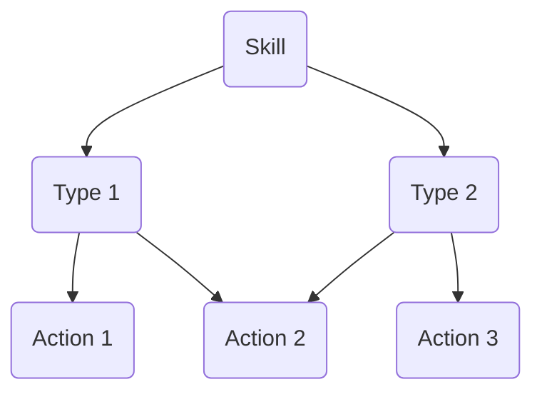

>[!note] Coming at some point
>Skill trees are my dream of making unique fighter archetypes by defining new combat actions and in general enabling players to fulfill their wildest dreams. A close-combat mage, that creates shields just in time to parry his opponents strikes and attacks with blasts of energy? Why not? But not only combat skill should be covered. You want to be a master craftsman? A battlefield surgeon? Or the best history professor ever? Your skill trees will be as unique as your character.
> 
>Currently this is more of a vague concept than actual rules but skill trees will be a huge part of making F.A.B.R.I.C. adaptable to your own creativity. 

%%Generally skill trees should grow from broad to very specific. A first idea was to have a certain skill as the root and grow the following tree: 

Here types would be something like fast (FIN), precise (WIT), powerful (CON), psychological (CHA), Ellusive (MOT), Sacrificing (WIL) that create new actions with the corresponding attribute,  based on [[Conditions and Character state#Condition rating (*experimental*)|Condition rating]]. 

Currently skill trees are a vague idea that aim to make different fighting styles and magic paths possible. %%